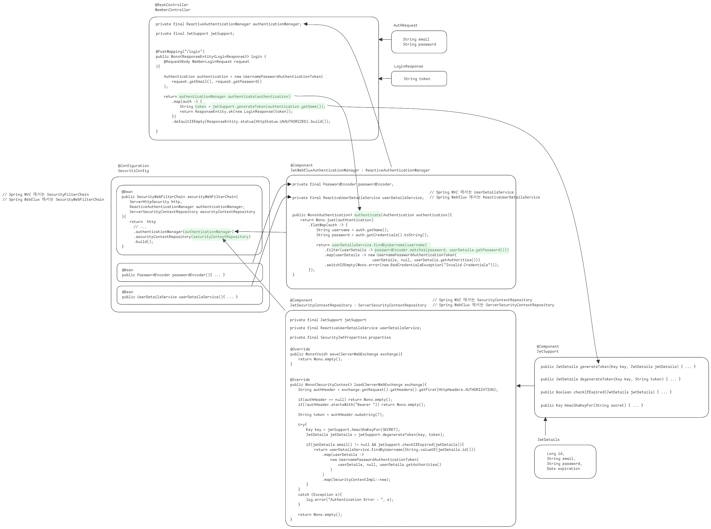

## prototype - Webflux Spring Security + Reactive Gateway + Jwt

Spring Webflux Gateway 내에서 JWT 인증을 모두 수행하는 경우의 예제를 정리하는 프로젝트입니다. MSA 기반이 아닌 싱글인스턴스 기반으로 계정 서비스를 운영할 경우에 대한 예제이며, 가급적이면 Webflux Gateway, Security, JWT 의 필수 요소 들 중 필요한 부분만 한눈에 볼 수 있도록 하기 위해 복잡한 R2DBC 설정, 테이블 설계 내용들은 모두 배제했습니다. 

고도화나 리팩토링 없이 어느 정도는 하드코딩으로 원리와 개념만 보이도록 원시적인 코드입니다. 

코드는 조만간 커밋 예정입니다. 

## Security 

전체 구조도는 아래와 같습니다.

 

## SecurityConfig, UserDetailsService, PasswordEncoder

편의상 아래의 요소들은 별도의 컴포넌트에 따로 구현하지 않고 SecurityConfig 설정 파일에 Bean 으로 등록합니다. 

**UserDetailsService** 

이번 프로젝트에서는 아래의 사용자들을 Map 으로 입력해둔후 맞는지 판단하는 인증을 거칩니다. 

- id : `aaa@gmail.com` , password: `aaaaa` 
- id : `bbb@gmail.com` , password: `bbbbb`
- id : `vvv@gmail.com` , password: `vvvvv`

이 내용은 SecurityConfig 내에 정의한 UserDetailsService Bean 을 정의하는 메서드를 확인해보시면 됩니다. 

username 을 email 로 해서 조회하도록 지정했습니다. 만약 email 을 바꿀 수 있는 계정 시스템을 구현한다면, 별도의 unique key 를 컬럼으로 두거나, 별도의 id키를 가지는 테이블을 하나 더 두어서 member 테이블이 이 테이블을 참조하도록 지정하는 것도 하나의 선택이 될 수 있습니다. 이번 구현에서는 이런 세부적으로 투머치한 내용까지는 다루지는 않습니다. 

 

**PasswordEncoder** 

PasswordEncoder 는 `BcryptEncoder` 를 사용합니다.

- BcryptEncoder

 

위의 요소들은 모두 약식으로 SecurityConfig 내에서 Bean 으로 선언합니다.

 

## JwtAuthenticationManager::authenticate(Authentication)

JwtAuthenticationManager 는 ReactiveAuthenticationManager 를 구현(implements)하는 클래스이며 이번 예제에서 직접 작성하게 될 클래스이며 Bean 으로는 등록하지 않고 SecurityConfig 내에서 내부적으로 1회 객체 생성을 해서 httpSecurityFilterChain 내에 등록합니다. 

JwtAuthenticationManager 는 authenticate(Authentication) 라는 메서드를 구현했는데, 이 authenticate(Authentication) 메서드로 인증을 수행할 수 있는데, 직접 작성해서 등록한 JwtAuthenticationManager 에서는 UserDetailsService,PasswordEncoder 를 주입받아서 아래의 역할을 수행합니다.

- UserDetailsService
  - 사용자가 존재하는지 조회하고 그 결과를 UserDetails 객체로 리턴합니다.
- PasswordEncoder
  - matches() 메서드를 통해 Request 로 전달받은 password 와 UserDetailsService 에서의 조회결과로 전달받은 UserDetails 내의 password 가 일치하는지 체크합니다.
  - Password가 올바르다면 아래의 절차를 거칩니다.
- UsernamePasswordAuthenticationToken
  - UserDetails 객체를 UsernamePasswordAuthenticationToken 으로 변환해주어 AuthenticationToken 을 리턴합니다.

 

JwtAuthenticationManager 의 authenticate(Authentication) 메서드는 Authentication 객체를 받아서 인증을 한다는 사실에 주목해주시기 바랍니다. 보통 UserDetailsService 로 모든 인증을 다 하드코딩하게 되면 Authentication 객체를 직접 만들고 하는 과정을 거치게 되지만, 이번 예제는 JwtAuthenticationManager 의 authenticate(Authentication) 메서드 내에서 Authentication 객체만 인자값으로 필요한 일만 담당합니다. 

## Gateway

현재 ip key 를 기반으로 하는 RateLimiter 를 달아두었습니다. 문서화는 시간이 나는대로 꾸준히 추가하겠습니다.  

Gateway 내에는 MemberController가 존재하고 있으며, 스프링 시큐리티를 이용해서 Gateway 서버가 인증을 직접 담당하고 있습니다. MSA로 전환할 경우에는 member-service에 이 작업을 넘겨주고 JWT 체크를 통한 인증을 수행하게끔 하면 됩니다. 각각의 msa 가 member-service 를 FeignClient, WebClient 등을 이용해서 통신을 수행하면 됩니다. 

Gateway 의 경우 EKS 내로 전환할 수도 있습니다. Spring Cloud for Kubernetes 에서 인프라레벨이 아닌 소프트웨어레벨에서 Spring Cloud 의 각 스택들을 개발할 수 있도록 지원하는 기능이 있습니다. 하지만 가급적이면 개발 또는 운영 초기에는 싱글인스턴스 또는 ELB,ALB 를 통한 다중화를 기반으로 해도 좋을수 있을 것 같습니다. Spring Cloud Config 서버, Eureka Server, Eureka Discovery 를 조합한다면 더 좋을수 있겠지만 이 셋 중에 하나를 꼭 선택하라면 Config 서버를 하나 잘 갖출것 같습니다. Config 서버를 잘 갖춰놓으면 필터에 관련된 yml 을 수정해서 푸시하는 것만으로 재배포 없이 그대로 Gateway 를 계속 띄워두면서 게이트웨이의 라우팅등과 관련된 변경사항을 반영하는 것이 가능해집니다. 

조금 더 복잡한 시스템의 Gateway 라면 가급적이면 Gateway 에서 상태가 있는 연산은 피하는게 좋을 것 같다고 생각합니다. 그냥 개인적인 견해\~\~\~\~\~\~

